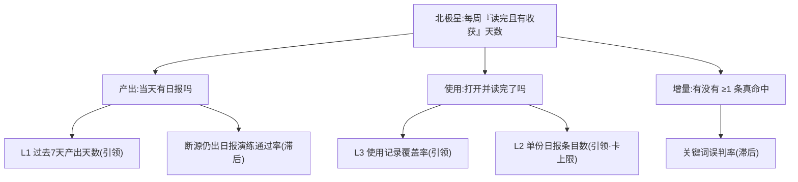

# 指标推导 · 找指标(第二轮:按升级后的 skill 重推)

本文档是 `.bw/metrics.toml` 的人读推导过程。**本轮(2026-08-05)是对上一轮
(PR #2,2026-07-28)的修订,不是推倒重来**——上一轮的三段拆解与「北极星必
须落在使用/价值段」的结论本轮全部维持,改动集中在上一轮没有的四件装置:
6 判据逐项打分、故意的坏候选对照、每条指标的成对反指标、引领/滞后强制判定
题与 0-40 质量门。

> **方法论来源(如实)**:北极星 6 判据打分、坏候选对照、BDFE 输入结构、
> NSM↔存续 KPI 系统校验,改编自 amplitude/builder-skills `north-star-metric`;
> 引领/滞后强制判定题、成对反指标、0-40 质量门与指标树乘法分解,改编自
> mohitagw15856/pm-claude-skills `metrics-framework` + `metric-tree-builder`。
> 两者都是 2026-08-04 那轮同模盲测的第一名(9.0/10 与 8.75/10)。

---

## 0. 输入摘要(每条都指回一个真实文件)

| 输入 | 真实状态 |
|---|---|
| `docs/competitive-analysis.md` | **不存在**——本轮仍无竞品分析报告输入,北极星推导只基于项目自身意图与真实运行记录,不假装读过 |
| 项目意图(`PROJECT.md`) | 痛点=AI 热点圈信息**过多**;机会=三个月内每天真实生成一份**不需手动修正**的摘要,覆盖社区热度+学术前沿两类源,命中自定义关注面 |
| 项目既有指标体系 | 无 `governance/`、无 `derive_*.py`。项目自己的过程量住在 `digests/telemetry.json`(`raw`/`hit`/`deduped`/`items`/`days`)与 `docs/SLO.md` 红线表里——**本轮优先复用它们**,不再照抄 BW 自有记账概念 |
| 真实运行数据 | `digests/telemetry.json` 当前快照 `{date: 2026-07-28, raw: 307, hit: 93, deduped: 92, items: 27, days: 1}` |
| 产出连续性 | `digests/` 实际只有 4 天产出(07-19/20/21/28),07-22~27 **连空 6 天**;全仓库无 `.github/`、无任何 `yml`/`yaml` → 无 CI 无定时任务,每份日报都是手敲出来的(`docs/validation.md` 已核实) |
| 优化阶段真实回归 | `docs/regression.md`:总耗时 74.29s→46.22s,最终输出条目 **111→30**,结论原文是「达到『日报』应有的可读体量」 |
| 复盘抽样 | `docs/retro.md` round #19:238 条真实抽样,1 处假阳性 ≈ **0.4%**(`RAG` 命中 "average");并已论证严格词边界会连带破坏 `LLM`→`LLMs`,**不修** |
| 断源红线 | `docs/SLO.md` 写「未测」,但 `docs/incident-drill.md`(07-20)真实做过一次 HN 源不可达演练,该源返回空列表 + 警告、不影响另一源 → **SLO.md 的「未测」已过期** |
| 上一轮北极星的采集实况 | `docs/validation.md`:4 个有产出的日子里 **0 天**有任何使用记录,`docs/usage-log.md` 至今不存在 → 北极星**零观测点** |
| BW 侧真实记账 | 该仓历史累计 **1 个** merged PR(#2,即上一轮找指标);当前 3 条 open issue(#1/#3/#4) |
| 格式契约 | `.bw/metrics.toml` 的结构契约住在 **BW 仓**的 `docs/metrics-toml-format.md`(不在本仓),本轮按其五值 `collect.kind` 封闭枚举与字段表逐项对照 |

---

## 1. 北极星

### 1.1 三段拆解 + BDFE

- **供给**:`digests/YYYY-MM-DD.md` 被生产出来(raw 307 → 命中 93 → 去重 92 → 限量后 27)。
- **使用**:构建者真的打开、读完。
- **价值**:省下自己刷 HN/arXiv 的时间,拿到 ≥1 条事前不知道、真命中关注面的信息。

BDFE 四维在单人自用项目上的落法(**Breadth 是退化维**,唯一用户恒为 1,不能拿它当北极星的量纲):

| 维 | 本项目的含义 | 用不用 |
|---|---|---|
| Breadth | 用户数 | ✗ 恒为 1,退化 |
| Depth | 当天真实拿到几条「事前不知道的命中信息」 | ✓ |
| Frequency | 一周里有几天真的打开并读完 | ✓ |
| Efficiency | 读完一份日报要花多少时间 / 每拿到 1 条有效信息要读多少条 | 作反指标与引领指标用 |

→ 北极星取 **Frequency × Depth 的复合**:每周里「读完 + 至少 1 条真增量」的天数。

### 1.2 6 判据打分(任一项 ≤2 直接淘汰)

候选:**「每周『读完且有收获』天数」**

| # | 判据 | 分 | 依据 |
|---|---|---|---|
| 1 | 落位 | **5** | 价值段:量的是「读完了 + 拿到原本会错过的信息」,不是文件存在 |
| 2 | 自动化免疫 | **5** | 挂一条永不失败的 cron,只能让 `digests/` 天天有文件,**不会**让这条指标涨一天——它的每一天都必须由人写下一次「是」 |
| 3 | 场景契合 | **5** | 直接对应 `PROJECT.md` 的痛点「信息过多」与机会「无需手动修正即可读」 |
| 4 | 定义精确 | **4** | 分子/分母/窗口/判定人/缺失记录如何计,全部写死;扣 1 分是因为「事前不知道」仍带自我报告的主观性(用 §1.4 的反指标兜) |
| 5 | 采集诚实 | **4** | 如实标 `manual`:项目里**没有任何**使用埋点,不为了体面标 `connector`/`script`;扣 1 分是因为这条 `manual` 至今零观测,不是「采得到只是还没采」 |
| 6 | 难造假 + 反指标 | **4** | 自我报告可以被自己宽松化,但造假成本高于收益(骗的是自己);已配反指标见 §1.4 |

无一项 ≤2 → 通过。

### 1.3 故意的坏候选对照(每条写清被哪一项判据挡下)

1. **「连续产出日报天数」** — 判据 2 自动化免疫 **1 分**、判据 1 落位 **1 分**。挂一条永不失败的定时任务,它从上线当天起永久满分;cron 只保证「跑了」,从不保证「有人读」。**这条不是假想:它此刻真实躺在 BW 看板上**(aihot 项目的 metric 表里有 `连续产出日报天数` 一行,1 个观测点),也是升级后 skill 正文引为真实反例的那一条。
2. **「每日命中率」(hit ÷ raw)** — 判据 1 落位 **2 分**、判据 6 难造假 **2 分**。它是过滤器的供给段口径;把关键词表放宽就能直接拉高,而放宽关键词恰恰会**增加**误判、让「读完」更难。真实数据补刀:93/307 = **30.3%**,而看板上这条指标的现行 target 是「≥8%」——真实水位高出下限近 4 倍,这条阈值形同虚设,且守的是下限,而 `docs/regression.md` 已经证明本项目的真实痛点在**上限**(太多读不完),方向反了。
3. **「累计生成日报天数」** — 判据 1 落位 **1 分**、判据 2 自动化免疫 **1 分**。单调不减,只涨不跌,永远绿;它衡量的是「这个项目还没死」,不是「它有用」。(同样真实在库:aihot 的 metric 表里有这一行,3 个观测点。)

### 1.4 北极星的反指标(不进 `.bw/metrics.toml`,只作护栏)

**「事后复核:被标为『事前不知道』、但其实在别处已经看到过的条目占比」**。
只优化北极星,最省力的作弊法就是把「事前不知道」的判定标准悄悄放松——这条
反指标正是 `docs/hypothesis.md` 自己写下的第三条证伪条件(「用户事后承认其实
那条信息我别的渠道也看到过」),把它固定成复核动作。**下次复核北极星,先看
这条有没有恶化。**

### 1.5 NSM ↔ 存续 KPI 的系统校验

这是单人自用项目,不存在收入/付费/融资,所以传导链的终点是**项目存续**(构建者是否继续投入维护):

> 每周「读完且有收获」天数 ↑ → 构建者对这份日报形成真实依赖 → 继续投入维护、扩源、修 bug → 项目存续、并具备被复制给他人的价值。

**诚实标注:这条传导链目前是纯逻辑推演,零真实数据验证。** 唯一沾边的真实
观察是反方向的一次:07-22~27 连空 6 天无产出,与「没有真实依赖时项目就停
更」方向一致——但样本 n=1,只能算线索,不算验证。

---

## 2. 指标树(乘法恒等式)与最高杠杆

北极星可以严格分解成三个因子的逐日乘积,不是一堆并列 KPI:

```
每周「读完且有收获」天数
  = Σ(过去7天) [当天有日报产出] × [当天被打开并读完] × [当天至少 1 条真增量命中]
             └── L1 产出天数        └── L3 使用记录覆盖率   └── 由 L2 体量 + 误判率共同决定
```



三个因子是**乘法**关系,任一为 0 则北极星为 0——这解释了当前的真实状态:
L1 = 1/7、L3 = 0/4,乘出来北极星必然是 **0**,和「产品好不好」还没有关系。

**最高杠杆的两条(按 敏感度 × 可动性 排序)**:

1. **L1 产出天数(1/7 → 5/7)**:它是乘法链的第一个因子,天花板本身。它现在是
   1,意味着另外两个因子做到 100% 也只能得 1 分。可动性极高——本项目缺的
   只是一条定时任务(全仓无 CI 是已核实事实)。
2. **L3 使用记录覆盖率(0% → ≥80%)**:它是**测量链的断点**。`docs/validation.md`
   已经证明:4 个有产出的日子里 0 天有记录,所以北极星至今零观测点,连
   「被证伪」都做不到。写一行字的成本几乎为零,收益是让整套指标第一次有数。

---

## 3. 引领/滞后:强制判定题逐条过

判定题(不凭直觉贴标签):(a) 这个数字在动作**当下/事前**能被直接影响吗?
(b) 它对结果有**预测性**吗?两条都「是」→ 引领;只能事后测、此刻改不了 → 滞后。

| 指标 | (a) 当下可影响 | (b) 有预测性 | 判定 | 变化 |
|---|---|---|---|---|
| 过去 7 天有真实日报产出的天数 | 是(跑不跑、挂不挂 cron) | 是(乘法链第一因子) | **引领** | 新增 |
| 使用记录覆盖率 | 是(写一行字) | 是(乘法链第二因子) | **引领** | 新增 |
| 单份日报条目数 | 是(`cap_per_source` 直接拧,下次运行生效) | 是(体量决定能不能读完) | **引领** | **由滞后改判** |
| 关键词误判率 | 否(要改匹配算法/关键词表,不是拧旋钮;真实值只能人工抽样事后得到) | 是 | **滞后** | 不变 |
| 断源仍出日报演练通过率 | 否(演练结果只能事后得到) | 是 | **滞后** | 不变 |

### 3.1 本轮被删掉的三条(分类诚实,宁删不硬塞)

- **「单次生成总耗时」(原引领,整条删除)**。(a) 可影响=是;(b) 预测性=**否**。
  上一版写的因果链是「耗时越长,用户越可能拖延或跳过当天的运行」——但一旦
  L1 靠定时任务解决,耗时和「今天有没有日报」就彻底脱钩;而在没有定时任务
  的今天,真实空档是连着 6 天,不是「因为要等 46 秒所以没跑」。**过不了预测
  性这一关的候选不配进引领层**,这正是质量门明令禁止的不诚实分类。耗时仍然
  是有价值的工程约束——它留在 `docs/SLO.md` 的红线表里,不上看板。
- **「每周合并 PR 数」(原引领,删除)** 与 **「队友结算 Issue 数」(原引领,
  删除)**。这两条是 BW/GitHub 的**自有记账口径**,不是本项目自己数的东西;
  升级后的 skill 明确:只有项目确实没有自己的过程指标时才用它们兜底。本项
  目有自己的过程量(`telemetry.json` 的 items、`digests/` 的产出天数),优先
  用项目自己的。真实数据也不支持保留:该仓历史累计只有 **1 个** merged PR,
  上一版自己就承认 target「≥1」是「起步猜测,非历史校准值」。

---

## 4. 阈值怎么校准的(每条都指回真实水位)

| 指标 | 真实水位 | 定的线 | 为什么是这条线 |
|---|---|---|---|
| L1 产出天数 | **1/7**(近 30 天仅 4 天有产出) | ≥5 | `PROJECT.md` 机会陈述的终点是「每天」(7/7),但一次性定 7/7 会让它从第一天起永远红、失去梯度。**升级规则写死在这里:连续两周达到 ≥5 后,阈值上调到 7,并在本文件留一次修改记录。** |
| L3 使用记录覆盖率 | **0%**(4 个产出日,0 条记录) | ≥80% | 允许一周漏 1 天(7 天里 ≥5.6 天),不允许「想起来才记」。这条是从零起步,不存在「贴着现状设」的问题 |
| L2 单份日报条目数 | **27**(07-28 telemetry) | ≤35 | 卡上限。`docs/regression.md` 的真实结论是 111 条不可读、30 条才「达到日报应有的可读体量」,所以线设在 30 之上留一点余量、远低于 111 |
| 误判率 | **0.4%**(238 抽样 1 假阳性) | ≤1% | 现状已达标,这条是**守住**不许恶化的线;`docs/retro.md` 已论证收紧匹配会连带砍掉真命中,所以不设更严的线去逼一个已知得不偿失的优化 |
| 断源演练通过率 | **1/1**(07-20 incident-drill) | 100% | 韧性红线没有「达标 80%」一说 |

---

## 5. 成对反指标(每条可优化的指标都配,不挑好写的配)

| 指标 | 反指标(会被悄悄牺牲的东西) | 它挡的具体作弊动作 |
|---|---|---|
| 北极星 | 「事前不知道」条目里其实在别处已见过的比例 | 放松「事前不知道」的自我判定标准来凑天数 |
| L1 产出天数 | **有产出但当天无使用记录的天数占比** | 挂 cron 天天出文件把 L1 刷到 7/7,而没有一天真的被打开——正是坏候选 ① 的作弊路径,这里用反指标当场抓住 |
| L2 单份日报条目数(卡上限) | **当日 items < 5 的天数** | 为压体量把内容砍到没东西可读;`PROJECT.md` 机会陈述里的「≥5 条命中」就是这条底 |
| L3 使用记录覆盖率 | **北极星本身(有收获天数)** | 为凑覆盖率每天敷衍记一笔——覆盖率涨而北极星纹丝不动,就是敷衍的指纹 |
| 误判率 | **每日命中条目总数(hit)** | 靠收紧关键词降误判,同时把真命中一起砍掉(`docs/retro.md` 已实证 `LLM`→`LLMs` 会被误伤) |
| 断源演练通过率 | **演练覆盖的断法种类数** | 每次只演练最容易通过的那一种(如只断 HN、不断 arXiv、不断网络层)来保 100% |

---

## 6. 本轮改了什么(与上一版 PR #2 的差异)

| 项 | 上一版 | 本轮 | 理由 |
|---|---|---|---|
| 北极星口径 | 连续『真实读完且有收获』**天数** | **每周**「读完且有收获」天数 | 连续口径会被**供给中断**误伤:07-22~27 空档 6 天,streak 归零,但那 6 天归零的原因是「没人跑脚本」,不是「读了没收获」,两件事被混成一个数。改成 7 天窗口计数后,供给问题由 L1 单独承担,北极星只回答价值问题。**零观测点,改名不丢任何历史**(已读回:该指标在 BW 库中无对应 metric 行、无 observation) |
| 单份日报条目数 | 滞后 | **引领** | 过强制判定题:参数直接可拧 + 对「能不能读完」有预测性 |
| 单次生成总耗时 | 引领 | **删除** | 过不了预测性这一关(§3.1) |
| 每周合并 PR 数 / 队友结算 Issue 数 | 引领 | **删除** | BW/GitHub 自有记账,不是项目自己的过程指标(§3.1) |
| 6 判据打分 / 坏候选对照 / 成对反指标 / 质量门 | 无 | **有** | 升级后 skill 的新增装置 |
| 断源红线的事实基础 | 引用 SLO.md 的「未测」 | 更正为 **1/1 已演练**(incident-drill.md 07-20),并指出 SLO.md 该行已过期 | 上一版漏读了 `docs/incident-drill.md` |

---

## 7. 采集方案的诚实评估 + 埋点缺口

**六条指标全部 `collect.kind = "manual"`。** 这不是偷懒,是当前真实状态——
但其中两条**本可以自动采**,如实列为缺口:

| 指标 | 现在 | 本可以是 | 缺什么 |
|---|---|---|---|
| L1 产出天数 | manual | `script` | 缺一个**只读**的 `scripts/derive_metrics.py`:扫 `digests/*.md` 数过去 7 天的文件数,输出 `data.json`;再在 BW 里配一个 `script` connector 指向它。数据本身是现成的、零网络、零副作用 |
| L2 单份日报条目数 | manual | `script` | 同上,值直接来自 `digests/telemetry.json` 的 `items` 字段 |
| 北极星 / L3 使用记录覆盖率 | manual | manual(短期) | 缺的不是脚本而是**数据源**:`docs/usage-log.md` 根本不存在。中期方案是 `docs/validation.md` 自己提的那条——日报末尾加一个一键反馈链接,把自我报告变成有真实入口的轻量埋点 |
| 误判率 / 断源演练 | manual | manual | 本质是人工抽样与人工演练,不该假装能自动采 |

**为什么不现在就把 L1/L2 标成 `script`**:那个脚本此刻**不存在**,标了就是编
一个采不出值的 query,等于把「将来能自动采」谎报成「现在能自动采」。这两条
翻牌是「绑数据」(metrics-binding)那件活的范围,不是本件。

**明确不做的一件事**:不能把 `scripts/healthcheck.sh` 或 `python3 -m aihot.main`
当成采集脚本——它们会**真的联网、真的生成当天的日报**。用生产动作去「采集」
供给类指标,等于让指标自己把自己刷绿,是最隐蔽的一种造假。采集脚本必须只读。

---

## 8. 0-40 质量门自评(<24 分退回重做)

| 判据(每项 0-10) | 得分 | 依据 |
|---|---|---|
| 分类诚实 | **9** | 三条引领全部过了强制判定题;删掉一条过不了预测性的原引领(耗时),把一条原滞后改判为引领(条目数)。扣 1 分:L2「条目数」的可影响性来自配置参数,而这个参数近期没人真的调过,可动性是推断的 |
| 预测性 | **8** | 三条引领在乘法恒等式里各占一个因子,不是「相关」而是「构成」。扣 2 分:第三个因子(真增量命中)只能间接由误判率 + 体量推,没有直接的引领量 |
| 阈值真实 | **9** | 五条阈值四条指回真实数字(1/7、0%、27 与 111→30、0.4%、1/1),并写死了 L1 的上调规则。扣 1 分:L3 的 ≥80% 是从零起步的合理选择,没有历史水位可校准 |
| 防作弊完整 | **9** | 六条指标逐条配了成对反指标,且每条都写清挡的是哪个具体动作(尤其 L1↔无记录天数,直接堵住 cron 刷绿这条路)。扣 1 分:反指标本身目前全靠人自觉复核,没有机制强制 |

**合计 35/40**(mohit 口径的 ship-quality 线是 32,BW 口径的退回线是 24)。

---

## 9. 复核节奏

- **每周**:看 L1/L3 两条(乘法链的两个断点),不看北极星——北极星在 L1、L3
  起来之前必然是 0,盯它没有信息量。
- **两周**:L1 连续两周 ≥5 → 按 §4 把阈值上调到 7,在本文件留修改记录。
- **每季度**:重跑一次本文件的 §1.2 判据打分与 §5 反指标复核;任何指标改
  名/改定义都在这里留一次记录,不静默改写历史(`(层级, name)` 就是这条指
  标的身份,改名等于新建一条、历史观测会跟丢)。
